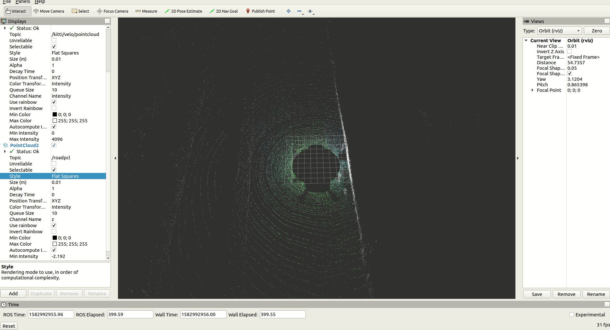

# road_pcl

## A ROS Package for Driving Road Segmentation using RANSAC Algorithm.

### How to run:

* First you need to build the package using `catkin_make`
* `$ rosrun road_pcl road_pcl _topicName:=/kitti/velo/pointcloud _maxIter:=100 _leafSize:=0.01 _distanceThresh:=1`

    * _topicName -> subscription topic.
    * _maxIter -> Maximum number of iteration for the RANSAC Algorithm.
    * _distanceThresh -> Distance threshold for the RANSAC Algorithm.
    * _leafSize -> VoxelGrid Leaf Size. 
